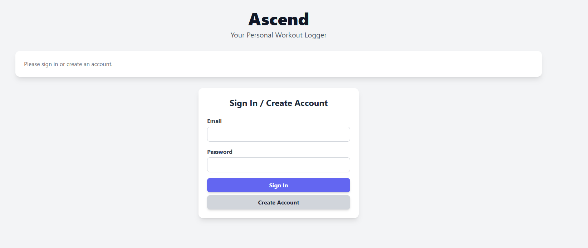
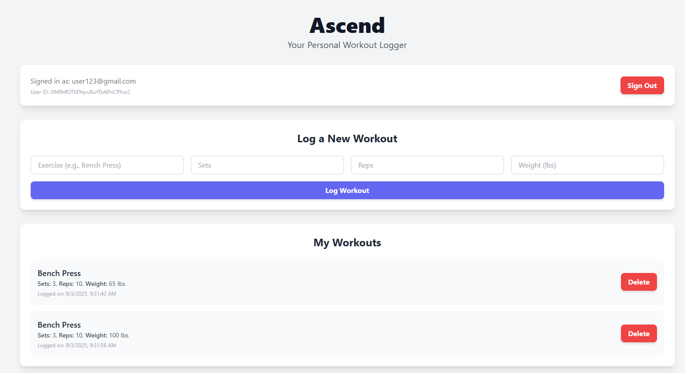
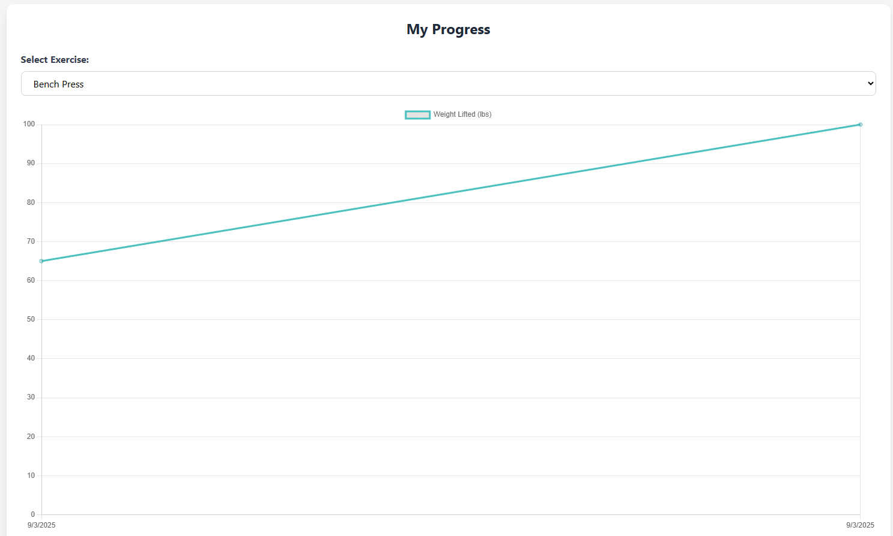

# Ascend 🏋️

Ascend is a lightweight web application that helps users track their exercises and visualize progress over time.
Built with **HTML**, **JavaScript**, and **Tailwind CSS**, it provides a clean interface and an interactive line chart to monitor your fitness journey.

---

## Features 🚀
- 📋 Add and track exercises with ease
- 📈 Line chart visualization to monitor progress
- 🎨 Modern, responsive UI powered by Tailwind CSS
- ⚡ Fast and simple - no backend required

---

## Project Structure 📂
```
ascend-main/
|- index.html      # Main HTML Structure
|- main.js         # Core JavaScript Logic
|- styles.css      # Custom styles (with Tailwind)
|- README.md       # Project documentation
|- .gitattributes
```

---

## Tech Stack 🛠️
- **Frontend:** HTML, JavaScript, Tailwind CSS
- **Charts:** [Chart.js](https://www.chartjs.org/) (for progress validation) 

---

## Getting Started 📖

1. **Clone the repository**
  ```bash
  git clone https://github.com/your-username/ascend.git
  cd ascend-main
  ```

2. **Open in browser**
  - Simply open `index.html` in your favorite browser.

3. **Start tracking**
  - Add exercise, log progress, and watch the chart update in real time!

---

## Preview 📸
- **Login Screen** 
- **Workout Screen** 
- **Progress Screen** 

---

## Contributing 🤝
Contributions are welcome!  If you'd like to imporve the projectt:
1. Fork the repo
2. Create a new branch (`feature/your-feature`)
3. Commit changes and push
4. Submit a pull request